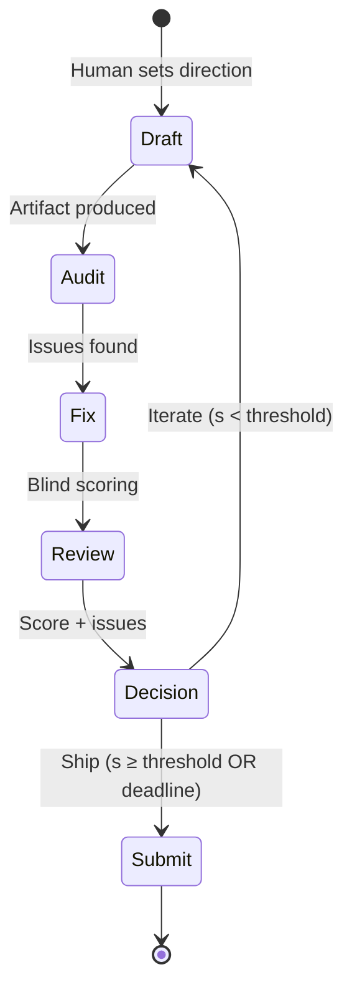

# Project Architecture

Quick reference for the STS research project. For agent role specs, see `agent_specs.md`.

---

## The Convergence Wheel

The project runs an iterative audit→fix→review loop on a research paper, measuring quality with blind independent reviews.



**State per cycle:** (score, issue count, cycles remaining)
**Stopping rule:** Submit when score ≥ threshold, or deadline forces stop.

---

## Score Trajectory (Experiment 7)

```
Linear:    v1(3.0) → v2(3.3) → v3(3.5) → v4(3.5) → v5(3.8) → v6(3.8) → v7(3.75) → v8(3.6) → v9(3.5)
                                                                    ↑ peak, escape phase begins
Parallel:                                                          ├── v10a(3.95) from v9, minimal fix
                                                                    ├── v10b(4.04) from v5, cherry-pick ← BEST
                                                                    ├── v10c(3.75) from v5, formalize
                                                                    └── v10d(3.67) from v5, smart+Bash ← WORST
```

**Key findings:**
- Text optimization converges in 1-2 cycles (+0.3 each), then enters escape phase (net destructive)
- Surgical precision beats comprehensive changes: v10b (5 edits, 4.04) >> v10d (20+ edits, 3.67)
- Text-editing ceiling ≈ 4.0 — breaking through requires real experiments
- v10b is the submission candidate (Accept conditional)

---

## Cross-Model Experiment (Running)

Tests whether AI code quality degrades under information asymmetry — the paper's core claim.

| | U (unconstrained) | D (disclosure) | S (specification) |
|---|---|---|---|
| **Claude** Sonnet 4 | N=5 | N=10 | N=5 |
| **GPT-4o** 2024-11-20 | N=5 | N=5 | N=5 |
| **Gemini** 2.5 Flash | N=5 | N=5 | N=5 |

**3 tasks** × above matrix = 150 runs. Measured by `sts_checker.py` (CC, ADF, CCR thresholds → PASS/FAIL).

**Hypothesis:** Pass rate under S > Pass rate under U, within each model.

Pre-registered: commit `05f8902`. Deviation: gemini-2.0-flash → gemini-2.5-flash (original discontinued).

---

## Agents

| Agent | Role | Isolation |
|---|---|---|
| Generator | Write paper drafts, code | Reads gates + specs |
| Auditor | Adversarial review | No prior reviews |
| Fixer | Apply remediations | No reviewer scores |
| Reviewer (Blind) | Independent scoring | NO access to anything except the artifact |
| Experimenter | Design + run studies | Reports raw data |
| Synthesizer | Compile trajectory | Measurement data only |
| **Finance Professor** | Strategic advisor | Separate from production |
| **Senior SDE** | Code review | Separate from experiment pipeline |

Full specs: `framework/agent_specs.md`

**Critical constraint:** Reviewer blindness is non-negotiable. Senior SDE never touches prompts, audit logic, or experiment outputs.

---

## Paper Reframe (Professor-Validated)

**Old:** "We built STS, a tool that audits code quality."
**New:** "We prove the software delivery market needs a search good layer."

Three-layer structure:
1. **Market diagnosis** — software architecture is a credence good, adverse selection follows
2. **General solution** — four properties any conversion layer must satisfy
3. **Existence proof** — STS + cross-model experiments

STS is the demo, not the contribution. The search good layer is abstract — agents, metrics, or hybrid could implement it.

---

## Key Files

| File | Purpose |
|---|---|
| `paper/STS_Finance_Paper_v10b.md` | Submission candidate |
| `run_cross_model_experiment.py` | Experiment runner |
| `analyze_results.py` | Statistical analysis |
| `sts_checker.py` | Measurement instrument |
| `framework/agent_specs.md` | Agent role constraints |
| `framework/experiments/exp_cross_model_design.md` | Pre-registered design |
| `notes/paper_restructure_plan.md` | Restructuring instructions |
| `notes/reframe_search_good_layer.md` | Reframe rationale |
| `records/version_registry.md` | Complete Exp 7 data |

---

## Timeline

- **Now:** Cross-model experiment running (~150 API calls)
- **Next:** Analyze results → rewrite Section 4 → restructure paper (20-22 pages)
- **March 18:** UCLA Anderson submission deadline
- **April 24:** Conference date
